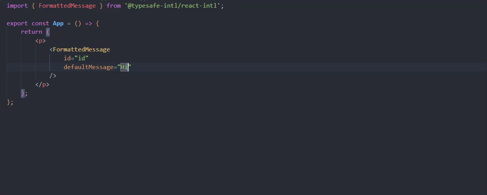

# typesafe-intl
Automatic typesafe interpolation values for [ICU message format](https://formatjs.io/docs/core-concepts/icu-syntax/) based translation strings.

## Why?

- 🐞 Catch bugs at compile time, rather than execution time.
- 💡 Instant feedback without type generation. Everything is inferred!
- 🚀 Awesome DX with autocomplete / intellisense across all editors.
- 🛠️ Confidently make changes, also in large and complex codebases.
- 🤝 Works with your existing [react-intl](https://www.npmjs.com/package/react-intl) message-extraction / id-generation workflow

Here you can see how the type for the `values` prop is automatically added/removed and inferred from the `defaultMessage` prop as you type.



## Overview

The goal of this project is to write a fully compliant ICU message format parser in Typescript's type system that provides typesafe interpolation values just by using inference. **No types are generated!**

It consists of two main packages:

1. [@typesafe-intl/core](packages/core/README.md): A ICU message format parser written in Typescript.
2. [@typesafe-intl/react-intl](packages/react-intl/README.md): A wrapper around the popular [react-intl](https://www.npmjs.com/package/react-intl) library, integrating `@typesafe-intl/core` for automatic typesafe interpolation values.

**This package has the same API as `react-intl` and does not add any runtime javascript code. It works just at the type level. All of the javascript functionality comes from the `react-intl` library itself.**

## Quick Start Guide

### Installation

To start using `@typesafe-intl/react-intl` in your existing project that already uses `react-intl`, install both the core package and the react-intl wrapper package:

```bash
npm install @typesafe-intl/core @typesafe-intl/react-intl
```

### Usage

There are 3 ways on how you can use the powerful automatic type inference for your interpolation values. In all ways the `values` object is automatically inferred based on either your `defaultMessage` or `id` prop.

1. Using a `defaultMessage` directly

```tsx
import { FormattedMessage, useIntl } from '@typesafe-intl/react-intl';

// Component API
const Example = () => {
    return (
        <p>
            <FormattedMessage
                id="sayhi"
                defaultMessage="Hello {who}!"
                values={{ who: 'World' }} // inferred as { who: string }
            />
        </p>
    );
}

// Hook API
const Example = () => {
    const { formatMessage } = useIntl();
    return (
        <p>
            {formatMessage(
                { id: 'sayhi', defaultMessage: 'Hello {who}!' },
                { who: 'World' } // inferred as { who: string }
            )}
        </p>
    );
}
```

2. Using a `id` with a central definition of your messages

```tsx
import { createFormattedMessageComponent, useIntl } from '@typesafe-intl/react-intl';

// define your messages once and annotate them with `as const`.
const messages = {
    SAY_HI: 'Hello {who}!'
    ...
} as const;

// create a typesafe version of the `FormattedMessage` component based on your messages
const FormattedMessage = createFormattedMessageComponent<typeof messages>();

// Component API
const Example = () => {
    return (
        <p>
            <FormattedMessage
                id="SAY_HI" // autocompletion for the id
                values={{ who: 'World' }} // inferred as { who: string }
            />
        </p>
    );
}

// Hook API
const Example = () => {
    // pass the type of your messages to the hook for autcompletion on the `id` prop and typesafe interpolations
    const { formatMessage } = useIntl<typeof messages>();
    return (
        <p>
            {formatMessage(
                { id: 'SAY_HI' }, // autocompletion for the id
                { who: 'World' } // inferred as { who: string }
            )}
        </p>
    );
}
```

3. Using `defineMessages`

If you are using `defineMessages` to define your translations with `react-inl` you can either

- Keep using it, but annotate the object with `as const`. Example: `const messages = defineMessages({ ... } as const);`
- Or use the `defineMessages` function from `@typesafe-intl/react-intl`

The important part here is that the type of the `defaultMessage` is not `string` but the literal type ( `'Hello {who}!'` ).

```tsx
import { FormattedMessage, useIntl, defineMessages } from '@typesafe-intl/react-intl';

// define your messages
const messages = defineMessages({
    one: {
        id: 'one',
        description: 'description for one',
        defaultMessage: 'Hello {who}!',
    },
    two: {
        id: 'two',
        description: 'description for two',
        defaultMessage: '{unreadEmails, number} unread Emails',
    },
});

// Component API
const Example = () => {
    return (
        <p>
            <FormattedMessage
                {...messages.one}
                values={{ who: 'World' }} // inferred as { who: string }
            />
        </p>
    );
}

// Hook API
const Example = () => {
    const { formatMessage } = useIntl();
    return (
        <p>
            {formatMessage(
                messages.two,
                { unreadEmails: 42 } // inferred as { unreadEmails: number }
            )}
        </p>
    );
}
```

## Documentation

### ICU syntax examples

| Explanation                  | ICU Syntax                                                                                       | Typescript                                     |
|------------------------------|--------------------------------------------------------------------------------------------------|------------------------------------------------|
| String                       | `"Hello {who}!"`                                                                                 | `{ who: string }`                              |
| Number                       | `"{unreadEmails, number} unread Emails"`                                                         | `{ unreadEmails: number }`                     |
| Number with format: percent  | `"{percent, number, percent} complete"`                                                          | `{ percent: number }`                          |
| Number with format: currency | `"Price: {price, number, ::currency/GBP}"`                                                       | `{ price: number }`                            |
| Date                         | `"Sale begins on {start, date}"`                                                                 | `{ start: Date }`                              |
| Date with format: full       | `"Sale begins on {start, date, full}"`                                                           | `{ start: Date }`                              |
| Time                         | `"Coupon expires at {expires, time}"`                                                            | `{ expires: Date }`                            |
| Time with format: full       | `"Coupon expires at {expires, time, full}"`                                                      | `{ expires: Date }`                            |
| Select                       | `"{gender, select, male {He} female {She} other {They}} will respond shortly."`                  | `{ gender: 'male' \| 'female' \| 'other' }`    |
| Plural                       | `"You have {itemCount, plural, =0 {no items} one {# item} other {# items}}."`                    | `{ itemCount: number }`                        |
| Selectordinal                | `"It's my cat's {birthday, selectordinal, one {#st} two {#nd} few {#rd} other {#th}} birthday!"` | `{ birthday: number }`                         |
| Rich text                    | `"Our price is <bold>very low</bold>"`                                                           | `{ bold: (chunks: ReactNode[]) => ReactNode }` |
| Escaping                     | `"Hello '{firstname}' {lastname}"`                                                               | `{ lastname: string }`                         |


### Specify / override the typescript types

All of the typescript types can be overridden by using module augmentation.

```ts
declare module '@typesafe-intl/react-intl' {
    export interface TypesForInterpolations {
        'string-interpolation': string | number;
        'date-interpolation': Date | number;
    }
}
```

With this declaration the following types will be inferred:

| Explanation | ICU Syntax                       | Typescript                  |
|-------------|----------------------------------|-----------------------------|
| String      | `"Hello {who}!"`                 | `{ who: string \| number }` |
| Date        | `"Sale begins on {start, date}"` | `{ start: Date \| number }` |


A full list of all possible / supported overrides can be found [here](https://github.com/jarvispact/typesafe-intl/blob/main/packages/core/src/infer-interpolations.ts#L8)